# Lucen AI — Technical Deep Dive & System Architecture
> **Evidence Intelligence for Insurance Claims**  
> *"Illuminate the Claim. Eliminate the Fraud."*

---

## 1. Executive Summary & Problem Context

Insurance companies lose billions annually to fraudulent claims. Traditional fraud detection relied on manual adjusters or simplistic black-box rules. With generative AI tools (Midjourney, Stable Diffusion, Flux, generative inpainting) and digital PDF editors, fraudsters can easily forge:
1. **AI-generated vehicle crash damage or property loss photos**.
2. **Manipulated repair bills, medical invoices, and parts invoices** with altered totals or forged dates.
3. **Synthetic identity photos** or reused vehicle photos submitted under different claim IDs.

**Lucen AI** is an explainable, multi-modal forensic fraud detection platform. It ingests claim images, PDF documents, and identity photos, executes a battery of **12+ forensic detectors**, fuses their evidence using **Bayesian probability**, calibrates the output, and produces an **auditable risk score, interactive heatmap, and PDF investigation report**.

---

## 2. High-Level System Architecture

```mermaid
flowchart TD
    User["Adjuster / User Interface (React + Tailwind)"] -->|POST /api/v1/analyze/*| API["FastAPI Gateway"]
    API -->|Create Async Job| JM["JobManager (asyncio background task)"]
    JM --> Orch["Orchestration Engine"]
    
    subgraph MultiModalPipelines ["Forensic Detection Layer"]
        Orch --> IP["Image Forensics Pipeline"]
        Orch --> DP["Document Forensics Pipeline"]
        Orch --> IDP["Identity Biometrics Pipeline"]
        Orch --> CP["Cross-Modal Claim Verification"]
    end
    
    subgraph MathEngine ["Decision & Scoring Engine"]
        MultiModalPipelines --> QG["Quality Gating (Resolution / Blur / OCR checks)"]
        QG --> Fusion["Noisy-OR Bayesian Fusion"]
        Fusion --> Calib["Temperature Scaling Calibration"]
        Calib --> Overrides["Hard Deterministic Override Rules (O1-O5)"]
        Overrides --> Explain["Template & LLM Explainability Engine"]
    end
    
    Explain --> DB[("SQLite Database & Hash Index")]
    Explain --> Artifacts["Forensic Heatmaps & PDF Reports (ReportLab)"]
    JM -->|Poll status / GET results| User
```



---

## 3. Computer Vision & Deep Learning Concepts (Connecting to your DL knowledge)

Since you have completed up to Deep Learning, here is how each component relates to neural networks, signal processing, and vision concepts:

### A. Frequency-Domain AI Image Detection (2D Fast Fourier Transform)
- **Concept**: Convolutional Neural Networks (CNNs) and Latent Diffusion Models (Stable Diffusion, Midjourney) generate images via upsampling layers (e.g., transposed convolutions or bilinear upsampling).
- **The Artifact**: These discrete upsampling grids leave **periodic spectral spikes and abnormal high-frequency energy decay** in the 2D frequency spectrum that natural cameras never produce.
- **Our Implementation** (`backend/app/detectors/image/ai_detector.py`):
  1. Convert image to grayscale and compute the 2D Fast Fourier Transform ($FFT$):
     $$\mathcal{F}(u, v) = \sum_{x=0}^{M-1} \sum_{y=0}^{N-1} f(x, y) e^{-j 2\pi (\frac{ux}{M} + \frac{vy}{N})}$$
  2. Shift zero-frequency components to the center (`fftshift`) and compute the log magnitude spectrum:
     $$S(u, v) = 20 \log(|\mathcal{F}_{shift}(u, v)| + \epsilon)$$
  3. Compute the ratio of high-frequency radial band energy vs. mid-frequency band energy.
  4. Pass through a calibrated sigmoid curve to yield the synthetic image probability $P(\text{AI})$.

### B. Error Level Analysis (ELA) for Tamper & Splice Detection
- **Concept**: JPEG is a lossy compression algorithm operating on $8 \times 8$ pixel Discrete Cosine Transform (DCT) blocks.
- **The Artifact**: When an authentic image is saved, all blocks settle into a uniform error rate. If a fraudster pastes a scratch or dent from another image, that spliced region has been compressed a different number of times, creating a sharp **discontinuity in JPEG resaving error**.
- **Our Implementation** (`backend/app/detectors/image/ela.py`):
  1. Recompress the image at 95% JPEG quality.
  2. Compute absolute difference: $\Delta(x, y) = |I_{\text{original}}(x, y) - I_{\text{recompressed}}(x, y)|$.
  3. Scale the difference to 0–255 to reveal localized tampering heatmaps.

### C. High-Frequency Noise Residual Variance
- **Concept**: Natural camera sensors generate Gaussian/Poisson photon noise distributed uniformly across the entire sensor surface.
- **The Artifact**: An altered or in-painted area will either have smoothed noise (blurring) or mismatched noise characteristics compared to surrounding pixels.
- **Our Implementation** (`backend/app/detectors/image/noise.py`):
  1. Apply a high-pass Gaussian filter to subtract the low-frequency image content, leaving only the noise residual: $R(x, y) = I(x, y) - \text{GaussFilter}(I(x, y))$.
  2. Divide the image into $16 \times 16$ grid patches.
  3. Compute the variance of $R$ within each patch and test for spatial variance outliers.

### D. Perceptual Hashing (pHash) for Deduplication
- **Concept**: Cryptographic hashes (MD5, SHA-256) change completely if a single pixel changes (avalanche effect). Perceptual hashes capture visual feature structure invariant to minor resizing, brightness changes, or recompression.
- **Our Implementation** (`backend/app/detectors/image/duplicates.py`):
  1. Resize to $32 \times 32$, compute Discrete Cosine Transform (DCT).
  2. Retain the top $8 \times 8$ low-frequency coefficients.
  3. Compare against previous claims in SQLite using Hamming distance:
     $$\text{Hamming}(H_1, H_2) \le 5 \implies \text{Duplicate Claim Detected}$$

---

## 4. Document Forensics & Logic Inconsistency Detection

In insurance fraud, documents (bills, repair invoices, receipts) are frequently edited using PDF editors.

### A. Digital vs. Scanned PDF Classification (`doc_kind.py`)
- Distinguishes whether the PDF contains genuine vector font glyphs, embedded scan bitmaps, or suspicious hybrid layers.

### B. Math & Timeline Logic Checks (`rules.py`)
- **Sum Verification**: Extracts line items and checks if $\sum \text{items} == \text{Subtotal} + \text{Tax} == \text{Total}$.
  - In our demo sample (`tampered_invoice.pdf`), line items total \$29,500, but the fraudster altered the total to \$48,500. This triggers a deterministic rule violation (`DOC-LOGIC-01`).
- **Date Chronology**: Verifies that `Invoice Date` $\le$ `Due Date` and `Incident Date` $\le$ `Claim Date`.

### C. Font Substitution & Typographic Outliers (`fonts.py` & `anomaly.py`)
- Analyzes PDF content streams for font family mixing, size mismatch on numerical totals, and character bounding-box misalignments.

---

## 5. Decision & Probability Fusion Engine

In machine learning and statistics, you never rely on a single detector. But how do you combine 12 different detectors with different error rates?

### A. Quality Gating (`quality.py`)
- If an image is extremely dark ($< 15$ mean luminance), blurry (Laplacian variance $< 30$), or low-res ($< 400 \times 400$), neural detectors become unreliable.
- Quality gating flags a `QualityWarning` and discounts detector weights to prevent false positives.

### B. Noisy-OR Bayesian Fusion (`fusion.py`)
- Rather than a naive average, Lucen AI uses **Noisy-OR combination**:
  $$R = 1 - \prod_{i=1}^{N} (1 - w_i \cdot p_i)$$
  where:
  - $p_i$ is the calibrated risk probability from detector $i$.
  - $w_i$ is the reliability weight ($0.0 \le w_i \le 1.0$) assigned to detector $i$.
- **Why Noisy-OR?** In fraud detection, one strong piece of conclusive evidence (e.g., duplicated claim hash or impossible invoice math) should push the risk high, even if other detectors are neutral.

### C. Temperature Calibration (Platt Scaling)
- Raw neural/heuristic model outputs are often overconfident. We apply temperature scaling:
  $$p_{\text{calibrated}} = \frac{1}{1 + \exp\left(-\frac{\text{logit}(p)}{T}\right)}$$
  where $T = 1.45$, ensuring probability scores match true empirical fraud rates.

### D. Hard Overrides (O1–O5 Rules)
- If an exact duplicate image hash is found $\implies$ Hard override to **1.0 (HIGH RISK)**.
- If invoice mathematical line items do not sum to total $\implies$ Hard override to **$\ge 0.85$ (HIGH RISK)**.

---

## 6. Full Technology Stack

| Layer | Technologies Used | Purpose |
| :--- | :--- | :--- |
| **Backend Framework** | **FastAPI** (Python 3.11), **Uvicorn** | Asynchronous REST API, high throughput, OpenAPI docs |
| **Computer Vision** | **OpenCV-Python-Headless**, **Pillow**, **NumPy**, **SciPy** | Image decoding, FFT spectral analysis, ELA, noise filtering |
| **Document Processing** | **PyMuPDF** (`pymupdf`), **RapidFuzz** | PDF text extraction, font introspection, fuzzy field parsing |
| **PDF Report Generation**| **ReportLab** | Generates court-ready, branded forensic PDF investigation reports |
| **Database** | **SQLite3** | Stores jobs, results, evidence catalog, and perceptual hashes |
| **Frontend Framework** | **React 18**, **TypeScript**, **Vite** | Modern, type-safe single-page application |
| **Styling** | **Tailwind CSS v4** (`@tailwindcss/postcss`), Lucide Icons | Dark slate-950 UI with amber/orange branding |
| **Deployment** | **Render** (Cloud Web Service) | Single-service container serving both FastAPI and built SPA |

---

## 7. Project File Structure

```text
ANDROSONIC/
├── backend/
│   ├── app/
│   │   ├── api/v1/          # Endpoints: /analyze, /jobs, /results, /health, /artifacts
│   │   ├── core/            # Config, errors, logging, security
│   │   ├── db/              # SQLite database and repository CRUD
│   │   ├── detectors/
│   │   │   ├── image/       # AI detector (FFT), ELA, noise, metadata, duplicates
│   │   │   └── document/    # Kind, rules, fonts, anomaly, PDF parser
│   │   ├── pipelines/       # Multi-detector orchestrators (Image, Document, Identity, Claim)
│   │   ├── scoring/         # Fusion, quality gating, overrides, calibration, risk bands
│   │   ├── explain/         # Template generator & LLM summary synthesis
│   │   ├── services/        # Orchestrator, JobManager, PDF report builder
│   │   └── main.py          # FastAPI application entry point & static SPA mounter
│   └── tests/               # Pytest suite (all 7 tests passing)
├── frontend/
│   ├── src/
│   │   ├── api/             # Typed API client and TypeScript interfaces
│   │   ├── components/      # Navbar, RiskBadge, ScoreGauge, EvidenceCard, ImageViewer
│   │   ├── routes/          # HomePage, AnalyzePage, ResultPage, HistoryPage
│   │   ├── index.css        # Tailwind v4 theme styling
│   │   └── App.tsx          # React Router setup
│   ├── package.json
│   └── vite.config.ts
├── data/demo_samples/       # Pre-generated sample invoices & images (clean and tampered)
├── build.sh                 # Cloud build script for Render
├── render.yaml              # Render infrastructure-as-code blueprint
├── requirements.txt         # Pinned Python dependencies
└── LUCEN_AI_EXPLANATION.md  # This comprehensive technical guide
```

---

## 8. Summary of What Was Built

1. **A Complete End-to-End System**: From raw image/PDF upload to asynchronous job polling, multi-detector extraction, Bayesian risk score computation, and visual reporting.
2. **Rebranded to Lucen AI**: Complete design identity with tagline *"Illuminate the Claim. Eliminate the Fraud."*, custom amber/slate visual hierarchy, and branded PDF exports.
3. **Resilient Production Architecture**: Free-tier memory optimized (no multi-gigabyte models required), retry-tolerant job polling, and single-port unified deployment.
